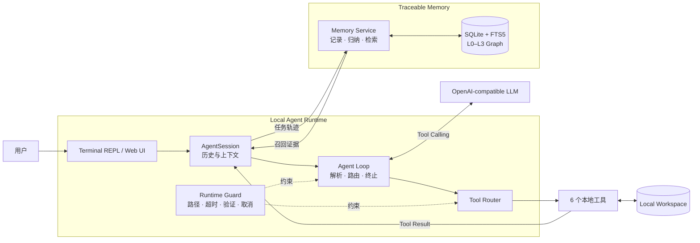
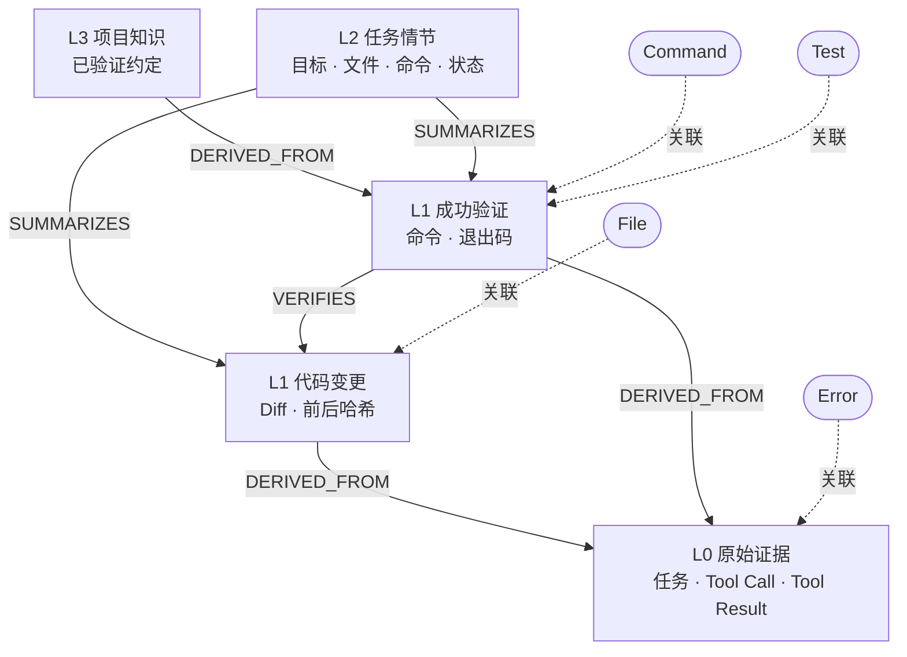

# Trace Coding Agent

一个运行在本地代码工作区中的编程智能体，具备自主工具调用、修改后强制验证，以及可回溯到原始执行证据的 L0–L3 分层记忆。

项目没有使用 LangChain、LlamaIndex、OpenAI Agents SDK 或 AutoGen 等 Agent 框架。Agent Loop、Session 上下文、Tool Router、运行时约束、任务报告和记忆构建均在仓库内实现；模型通过 OpenAI-compatible Tool Calling 接口参与推理，本地 Runtime 负责真正的文件访问、代码修改和命令执行。

GitHub：<https://github.com/mitbff/trace-coding-agent>

## 项目解决什么问题

普通的代码对话只能给出建议，缺少对真实执行过程的约束和记录。能够操作代码的 Agent 又会遇到三个具体问题：

1. 模型声称“已经修复”，但没有运行测试；
2. 下一次任务不知道此前修改了什么，只能重新探索；
3. 检索到的历史结论缺少来源，无法判断它来自成功测试、失败命令，还是模型自己的描述。

Trace Coding Agent 将编程任务组织为一个可观察的执行闭环：

```text
用户任务
  → 检索当前 Workspace 的历史证据
  → 模型选择本地工具
  → Runtime 执行并返回结构化结果
  → 模型根据结果继续操作
  → 修改后验证门控
  → 生成 TaskReport
  → 构建 L0–L3 记忆与来源关系
```

系统保存的不只是最终回答。代码 Diff、文件哈希、命令、退出码、测试输出和错误都会成为可查询的执行证据。

## 核心功能

| 能力 | 实现方式 | 可观察结果 |
|---|---|---|
| 自主编程闭环 | 模型原生 Tool Calling + 本地 Agent Loop | 文件读取、搜索、修改、命令执行连续完成 |
| 修改后强制验证 | Runtime 跟踪待验证状态，拒绝未验证的完成声明 | TaskReport 标记 `verified`、`failed` 或 `unverified` |
| 多轮 Session | 同一进程保存用户、Assistant、Tool Call 和 Tool Result | 可以自然追问“刚才修改了什么” |
| 跨 Session 记忆 | SQLite + FTS5/BM25 + L0–L3 图关系 | 新 Session 可以召回此前经过验证的项目事实 |
| 证据回溯 | `DERIVED_FROM`、`SUMMARIZES`、`VERIFIES` 等关系边 | 高层结论可以展开到原始工具结果 |
| 本地安全边界 | Workspace 路径隔离、超时、输出截断、保留目录保护 | 工具无法越界访问或直接读取记忆数据库 |
| 过程可视化 | Web UI 实时轮询执行事件和结构化报告 | 实时步骤、工具参数、耗时、Diff 和记忆来源同屏显示 |
| 可重复演示 | 固定错误样例、独立 Git 基线和环境检查脚本 | 每次从 `2 failed, 1 passed` 的相同状态开始 |

## 设计重点

### 1. 自行实现的 Agent Runtime

模型只负责提出动作，不直接接触文件系统。`AgentSession` 维护上下文并驱动 Agent Loop，`ToolRouter` 校验工具参数，Runtime 在固定 Workspace 内执行操作，再把结构化 Tool Result 写回上下文。



一次模型或工具调用失败不会让整个 Session 失效。错误会形成任务报告并保留为 L0 证据，用户可以继续发送下一项任务。相同动作连续失败时，Runtime 会注入重复失败警告；最大步骤数提供最终终止边界。

### 2. 修改后验证门控

`write_file` 或 `replace_text` 成功后，当前任务进入“待验证”状态。如果模型直接宣布完成，Runtime 会要求它继续运行测试、构建、Lint、类型检查或相关程序。只有真实命令成功后，本轮修改才会被标记为已验证。

验证关系精确指向本轮代码变更：

```text
L1 successful_command ──VERIFIES──> L1 code_change
                                      ├─ before_hash
                                      ├─ after_hash
                                      └─ unified diff
```

失败测试会被记录，但不会晋升为“项目的有效测试命令”。模型错误和取消任务只保留 L0，不进入默认的高层记忆检索。

### 3. L0–L3 分层可追溯记忆

记忆默认存储在 Workspace 的 `.trace-agent/memory.db`。SQLite 同时承担事务存储、关系图和 FTS5/BM25 全文检索，无需部署外部向量数据库。

| 层级 | 保存内容 | 构建规则 |
|---|---|---|
| L0 原始证据 | 用户任务、Tool Call、Tool Result、最终回答 | 执行过程中追加，不改写原始结果 |
| L1 原子记忆 | 代码 Diff、前后哈希、成功/失败命令和工具错误 | 从结构化 L0 确定性提取 |
| L2 任务情节 | 任务目标、涉及文件、命令和状态 | 每轮任务结束后归纳 |
| L3 项目知识 | 已验证的测试命令和项目约定 | 仅从可靠执行证据晋升 |



检索限定在当前项目，先从 L1–L3 中执行 FTS5/BM25 召回，再结合实体匹配、验证状态、层级和时效性排序，最后沿图关系回溯 L0。默认只向模型注入少量带来源 ID 的记忆；当前代码和历史记忆冲突时，以当前工具证据为准。

### 4. 结构化 TaskReport

每轮任务都会生成 `TaskReport`，主要包含：

- Session ID、任务轮次、状态和耗时；
- 每次工具调用的名称、参数、结果和错误；
- 本轮修改文件及 Unified Diff；
- 成功验证命令和验证状态；
- 检索到的记忆节点、分数、实体与来源路径；
- 模型错误、取消或达到步骤上限等终止原因。

终端、Web UI 和自动化评测读取同一个报告对象，不需要从自然语言回答中反向解析执行结果。

## 本地工具

| 工具 | 功能与约束 |
|---|---|
| `list_files` | 递归列出 Workspace 文件，过滤运行时保留目录 |
| `read_file` | 读取 UTF-8 文本文件，拒绝越界路径 |
| `search_code` | 按关键词搜索代码，返回文件、行号和匹配内容 |
| `write_file` | 创建或覆盖文件，返回前后哈希和 Diff |
| `replace_text` | 只替换唯一匹配片段；不存在或多处匹配时拒绝写入 |
| `run_command` | 在固定 Workspace 中运行测试或其他命令，支持超时和输出截断 |

## 安装

要求 Python 3.11 或更高版本。

```powershell
git clone https://github.com/mitbff/trace-coding-agent.git
cd trace-coding-agent
python -m venv .venv
.\.venv\Scripts\Activate.ps1
python -m pip install -e ".[dev]"
```

配置支持 OpenAI-compatible Tool Calling 的模型：

```powershell
$env:OPENAI_API_KEY="你的 API Key"
$env:OPENAI_MODEL="模型名称"
```

使用兼容网关时设置：

```powershell
$env:OPENAI_BASE_URL="https://example.com/v1"
$env:OPENAI_TIMEOUT="120"
$env:OPENAI_MAX_RETRIES="2"
```

API Key 只从环境变量读取。`.env`、Workspace 内容、运行轨迹和记忆数据库均由 Git 忽略。

## 快速开始

### Web UI

```powershell
trace-agent --interface web --workspace .\workspace --memory full
```

服务默认只监听 `127.0.0.1`，终端会输出浏览器访问地址。页面提供：

- 多轮任务对话与历史 TaskReport；
- 实时模型步骤、Tool Call 和 Tool Result；
- 工具参数、执行耗时与错误信息；
- 分层记忆召回及 L0 来源链；
- 本轮文件 Diff、Workspace 总 Diff 和验证状态；
- 任务协作式取消。

### Terminal REPL

```powershell
trace-agent --interface terminal --workspace .\workspace --memory full
```

REPL 本地指令不会发送给模型，也不会写入用户任务记忆：

| 指令 | 作用 |
|---|---|
| `/status` | 查看 Session、轮次、Workspace 和步骤上限 |
| `/tools` | 列出模型可调用的工具 |
| `/memory` | 查看记忆模式、项目标识和数据库位置 |
| `/diff` | 查看 Workspace 当前 Git Diff |
| `/report` | 查看最近一轮报告；`/report json` 输出 JSON |
| `/quit` | 正常关闭 Session |

也可以直接运行一次性任务：

```powershell
trace-agent "检查项目、修复错误并运行测试" --workspace .\workspace --memory full
```

记忆模式包括：

```text
full   记录 L0，构建 L1–L3，并在后续任务中检索
trace  只保存 L0 原始轨迹
off    关闭记忆
```

## 可复现演示：订单折扣修复

仓库提供固定错误样例。准备脚本会重建 `workspace/demo`、创建独立 Git 基线，并确认初始测试结果为 `2 failed, 1 passed`：

```powershell
.\scripts\prepare_demo.ps1
.\scripts\check_demo.ps1
trace-agent --interface web --workspace .\workspace\demo --memory full
```

在 Web UI 中依次输入：

```text
检查项目并运行测试，定位订单折扣计算错误，先不要修改代码。
```

```text
刚才具体是哪个函数有问题？为什么它会同时影响 pricing 和 order 的测试？
```

```text
根据刚才的诊断修复折扣计算，并运行完整测试。
```

前两轮展示诊断和 Session 内短期上下文，第三轮展示真实文件修改、Diff 和强制验证。随后停止服务但不要重新准备 Workspace，再次启动并输入：

```text
继续为折扣计算增加非法折扣率校验：折扣率必须位于 0 到 1 之间。补充测试并运行完整测试。
```

新 Session 会检索上一阶段形成的长期记忆。Web UI 可以展开召回节点，查看 `L3/L2/L1 → L0` 的来源链、验证状态以及 File、Command、Test、Error 等实体。

完整录制流程见 [`docs/DEMO_GUIDE.md`](docs/DEMO_GUIDE.md)。

## 测试

```powershell
python -m pytest -q
```

测试覆盖工具读写和路径边界、Agent Loop、修改后验证、Session 多轮上下文、任务报告、Web API、L0–L3 构建、项目隔离、失败证据隔离、跨任务检索和来源图回溯。

## 项目结构

```text
trace-coding-agent/
├─ src/trace_agent/
│  ├─ agent.py          # Agent Loop 与运行状态
│  ├─ session.py        # 多轮 Session 与 TaskReport
│  ├─ tools.py          # 本地工具和 Workspace 边界
│  ├─ memory.py         # L0–L3 构建、检索与图回溯
│  ├─ cli.py            # CLI 与终端 REPL
│  ├─ ui.py             # 本地 Web 服务
│  └─ web/              # Web UI 静态资源
├─ tests/               # Runtime、记忆、Session 与 UI 测试
├─ examples/order_demo/ # 可重复的订单折扣错误样例
├─ scripts/             # 演示准备与环境检查脚本
└─ docs/                # 技术设计、交互流程和验收记录
```

## 当前边界

- 当前面向单项目、单任务串行执行；
- L1–L3 采用确定性规则构建，尚未进行复杂代码语义抽取；
- FTS5/BM25 检索权重是可解释基线，尚未在大型任务集上调优；
- `run_command` 具备固定工作目录、超时和输出限制，但不等同于操作系统级容器沙箱；
- `replace_text` 面向精确文本替换，尚未实现通用 Unified Diff Patch；
- 实际执行速度取决于所选模型及其 Tool Calling 网关，因为一次任务通常包含多轮“模型—工具—观察”交互。

## 延伸文档

- [`docs/TECHNICAL_DESIGN.md`](docs/TECHNICAL_DESIGN.md)：运行时、记忆图和安全边界
- [`docs/INTERACTIVE_WORKFLOW.md`](docs/INTERACTIVE_WORKFLOW.md)：Session、REPL 与 Web 数据流
- [`docs/DEMO_GUIDE.md`](docs/DEMO_GUIDE.md)：演示录制流程
- [`docs/E2E_VALIDATION.md`](docs/E2E_VALIDATION.md)：端到端验证记录
- [`docs/INTERACTIVE_API_VALIDATION.md`](docs/INTERACTIVE_API_VALIDATION.md)：交互接口验收记录
