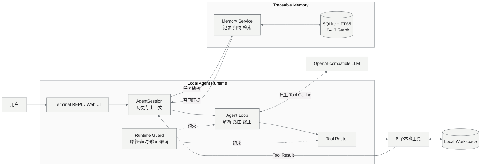
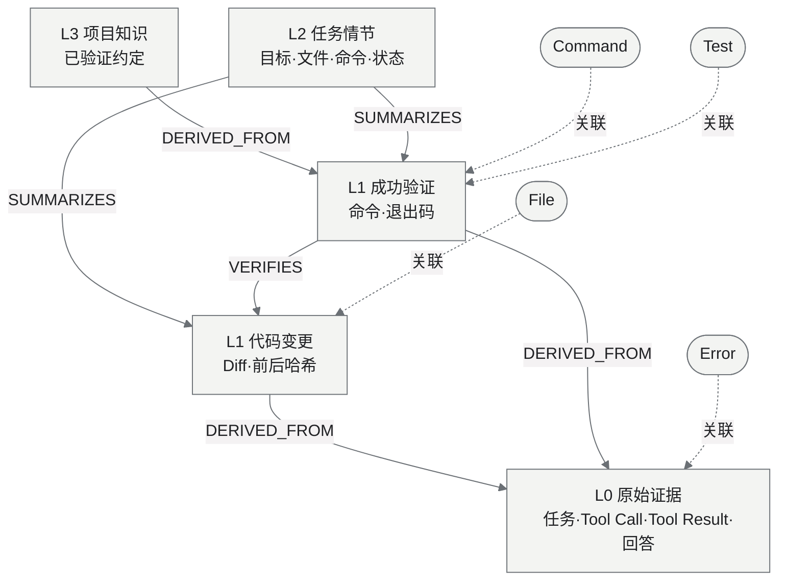

# Trace Coding Agent

GitHub：https://github.com/mitbff/trace-coding-agent

Trace Coding Agent 是一个自行实现运行时、具备分层可追溯记忆的编程智能体。项目未使用
LangChain、LlamaIndex、OpenAI Agents SDK 等 Agent 框架。模型通过 Tool Calling 调用文件
读取、代码搜索、局部修改、文件写入和命令执行工具；Runtime 负责路径隔离、超时、错误观察、
最大步数与修改后强制验证。

## 总体架构



| 组件 | 自行实现的职责 |
|---|---|
| `AgentSession` | 多轮历史、Context、Agent Loop、模型输出解析与终止 |
| `ToolRouter / Runtime` | 6 个本地工具、参数解析、路径隔离、超时与错误观察 |
| `RuntimeState` | 修改后强制验证、重复失败检测与执行状态 |
| `MemoryService` | L0–L3 构建、实体关联、图回溯与 FTS5/BM25 检索 |
| `TaskReport` | 工具调用、耗时、Diff、验证命令与记忆证据 |

## 分层记忆与可追溯关系

记忆使用 SQLite、FTS5/BM25 和图关系实现。L0 保存原始任务与工具证据，L1 提取代码变更和命令，
L2 汇总任务情节，L3 保存已验证的项目约定。高层记忆均可沿 `DERIVED_FROM`、`SUMMARIZES`、
`VERIFIES` 回溯到 L0。模型错误和取消任务只保留 L0，不参与默认检索。



Agent Loop、对话历史与上下文、Tool Schema、模型输出解析、Tool Router、本地文件/命令执行、
循环终止、错误处理和记忆构建均在仓库内实现。唯一运行依赖是模型厂商 API 客户端 `openai`；
代码执行和文件访问不依赖服务端托管工具。

## 运行

要求 Python 3.11+：

```powershell
pip install -e ".[dev]"
$env:OPENAI_API_KEY="你的 API Key"
$env:OPENAI_MODEL="支持 Tool Calling 的模型"
trace-agent --workspace .\workspace --memory full
```

启动后可选择终端对话或 Web UI，不会自动打开浏览器。也可直接运行：

```powershell
trace-agent --interface web --workspace .\workspace
```

Web 界面显示多轮对话、实时执行轨迹、Tool Call、记忆召回、Diff、TaskReport 和 Session 状态，
并支持安全停止。终端提供 `/status`、`/tools`、`/memory`、`/diff`、`/report` 和 `/quit`。

```powershell
python -m pytest -q
```

详细架构、记忆节点与边、交互流程和真实模型验收记录见 [`docs`](docs/)。API Key、`.env`、
Workspace 内容和记忆数据库均由 Git 忽略。
