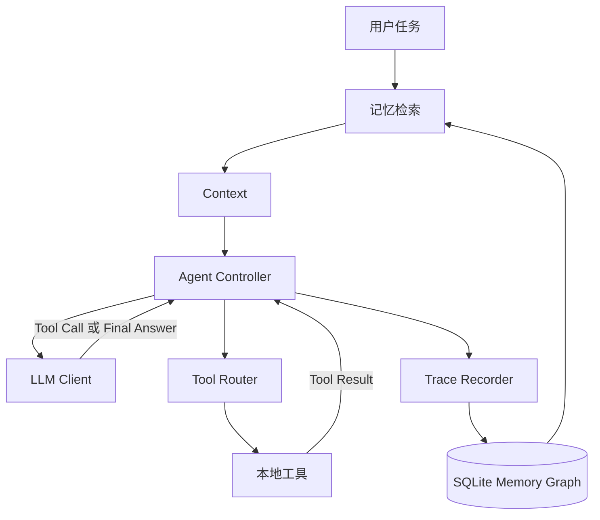

# Trace Coding Agent

Trace Coding Agent 是一个自行实现运行时、具备分层可追溯记忆的编程智能体。它通过
OpenAI 兼容接口调用大语言模型，在本地读取和修改代码、执行命令，并根据真实执行结果继续
推理。项目未使用 LangChain、LlamaIndex、OpenAI Agents SDK、AutoGen 等 Agent 框架。

系统关注两个问题：编程智能体如何形成完整的“推理—行动—观察”闭环，以及跨任务经验如何在
保留原始证据的前提下被构建和检索。

## 系统架构



大语言模型只提出动作，文件访问、命令执行和运行限制均由本地 Runtime 控制。Tool Result 会
作为观察写回 Context，Agent 据此继续执行，直到模型返回最终回答或达到最大轮数。

## 本地工具

| 工具 | 功能 |
|---|---|
| `list_files` | 递归查看 Workspace 内的文件 |
| `read_file` | 读取 UTF-8 文本文件 |
| `write_file` | 创建或覆盖文本文件 |
| `run_command` | 在 Workspace 中运行测试或其他命令 |

工具统一返回 JSON。路径不存在、参数错误、命令失败和超时会成为结构化观察，而不会直接终止
Agent。Runtime 还提供 Workspace 越界拦截、保留数据保护、命令超时、输出截断和最大轮数限制。

## 四层可追溯记忆

记忆保存在 Workspace 的 `.trace-agent/memory.db` 中。SQLite 同时承担事务存储、图关系和
FTS5/BM25 全文检索，不需要外部数据库。

| 层级 | 内容 | 构建方式 |
|---|---|---|
| L0 原始证据 | 用户任务、Tool Call、Tool Result、最终回答 | 在线追加，不改写 |
| L1 原子记忆 | 文件修改、成功命令、失败命令和工具错误 | 从 L0 确定性提取 |
| L2 任务情节 | 目标、涉及文件、命令及任务状态 | 任务结束后归纳 |
| L3 项目知识 | 已通过工具结果验证的项目约定 | 仅从可靠证据晋升 |

高层节点通过 `DERIVED_FROM`、`SUMMARIZES` 等边指向低层来源。工具调用和结果之间保存
`PRODUCES` 与反向来源边。文件、命令、测试和错误作为实体关联到记忆节点。

一条测试命令记忆的来源路径示例：

```text
L3 项目知识：Verified project test command: python -m pytest -q
  └─ DERIVED_FROM
L1 原子记忆：命令退出码为 0
  └─ DERIVED_FROM
L0 Tool Result：exit_code=0, 12 passed
  └─ DERIVED_FROM
L0 Tool Call：run_command
```

检索先在当前项目的 L1–L3 节点中进行 FTS5/BM25 召回，再结合实体匹配、验证状态、层级一致性
和时效性排序，最后沿图回溯 L0。默认只向模型注入 3–5 条带来源 ID 的短记忆；当前代码和工具
结果与历史记忆冲突时，以当前证据为准。

## 安装

环境要求：Python 3.11 或更高版本。

```powershell
git clone https://github.com/mitbff/trace-coding-agent.git
cd trace-coding-agent
python -m venv .venv
.\.venv\Scripts\Activate.ps1
pip install -e ".[dev]"
```

配置模型：

```powershell
$env:OPENAI_API_KEY="你的 API Key"
$env:OPENAI_MODEL="模型名称"
```

使用 OpenAI 兼容网关时另设：

```powershell
$env:OPENAI_BASE_URL="https://example.com/v1"
```

API Key 只从环境变量读取。`.env`、运行轨迹、记忆数据库和 Workspace 内容均不会提交到 Git。

## 运行

```powershell
trace-agent "检查项目、修复错误并运行测试" --workspace .\workspace
```

记忆提供三种模式：

```powershell
# 完整分层记忆：记录、归纳并在后续任务中检索（默认）
trace-agent "完成编程任务" --workspace .\workspace --memory full

# 只保存 L0 原始轨迹，不构建或检索高层记忆
trace-agent "完成编程任务" --workspace .\workspace --memory trace

# 关闭记忆，运行基础 Agent
trace-agent "完成编程任务" --workspace .\workspace --memory off
```

也可用 `--memory-db` 指定 SQLite 文件，用 `--max-steps` 调整最大模型轮数。

## 跨任务记忆演示

仓库中的 `examples/demo_project` 提供了一个带测试的计算器错误。先将该目录复制到
`workspace`，再运行 Agent：

```powershell
Copy-Item .\examples\demo_project\* .\workspace\ -Recurse -Force
trace-agent "检查当前项目，定位并修复计算器错误，然后运行合适的测试验证修改" `
  --workspace .\workspace --memory full
```

第一次让 Agent 修复项目并运行测试。任务结束后，Runtime 会保存修改文件、测试命令、退出码和
来源路径。第二次在同一 Workspace 中执行相关任务时，终端会在模型调用前显示：

```text
[MEMORY RETRIEVED]
l3:... (verified, score=...): Verified project test command: ...
Source: l0:...:tool_result
```

随后仍由 Agent 检查当前代码并执行真实工具。历史记忆用于减少重复探索，不替代当前环境验证。

## 测试

```powershell
python -m pytest -q
```

测试覆盖：

- 文件读写、命令执行和路径越界拦截；
- 保留记忆数据的访问保护；
- Agent Loop、Tool Result 回传和最大轮数终止；
- 记忆注入及执行事件记录；
- L0–L3 构建和来源边；
- 成功测试晋升与失败测试隔离；
- `trace` 模式和不同 Workspace 的记忆隔离；
- 跨任务检索与 L0 证据回溯。

当前测试结果：`12 passed`。

## 设计边界

- 当前面向单项目、单任务串行执行；
- L1–L3 使用确定性规则构建，尚未进行复杂代码语义抽取；
- 检索权重是可解释基线，尚未在独立编程任务集上做参数优化；
- `run_command` 有超时和固定工作目录，但不是操作系统级容器沙箱；
- 当前使用整文件写入，后续可增加更安全的局部 Patch 工具；
- 记忆模块异常时会输出警告并尽量保持 Agent 主循环运行。

这些边界使核心控制流保持清晰，也为局部编辑、修改后强制验证、版本化状态和检索消融留下了
明确扩展位置。
